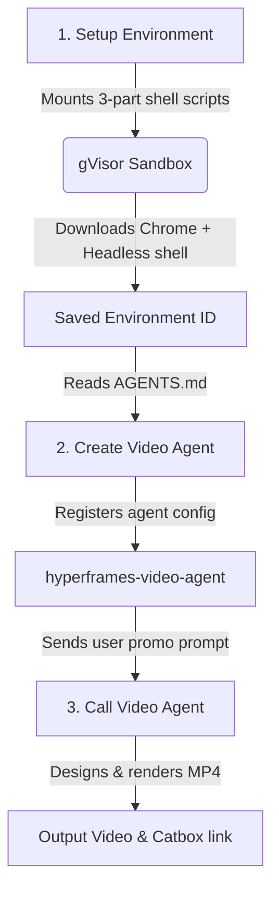

# HyperFrames Video Agent Example

This directory contains the standard scripts and instructions to provision, register, and execute an autonomous **HyperFrames Video Agent** inside a secure Google managed sandbox environment. 

Once configured, the agent is capable of autonomously designing, orchestrating, and rendering premium, high-performance HTML/CSS/GSAP video compositions to MP4 in under 17 seconds.

---

## Architecture Workflow

The video agent lifecycle operates in three distinct phases:



---

## Prerequisites

1. Install the Google GenAI SDK (v2.0.0 or later):
   ```bash
   pip install -U google-genai
   ```
2. Ensure your `GEMINI_API_KEY` is set:
   ```bash
   export GEMINI_API_KEY="your-api-key"
   ```

---

## Step-by-Step Guide

### Step 1: Setup HyperFrames Environment
The remote sandbox environment enforces a strict 300-second execution limit. To prevent timeouts, the setup is split into three sequential optimized scripts:
- `setup_1_chrome.sh`: Downloads Chrome and handles OS dependency extraction bypassing the `/opt` execution restriction.
- `setup_2_headless_and_cli.sh`: Installs optimized `chrome-headless-shell` and the `hyperframes` global CLI.
- `setup_3_skills_and_verify.sh`: Adds HeyGen skills and mirrors GSAP locally to support offline sandbox rendering.

Execute the orchestration script to provision the remote sandbox, run the setups, and save the environment ID:
```bash
python3 setup_hyperframes.py
```
*Note: This saves the environment ID to `hyperframes_env_id.txt`.*

### Step 2: Create Video Agent
Registers a custom managed agent called `hyperframes-video-agent` using the system instructions in `AGENTS.md`. This agent is specialized in the "Layout Before Animation" core design philosophy and knows how to leverage the pre-installed local libraries.

Run the registration and diagnostic validation script:
```bash
python3 create_video_agent.py
```

### Step 3: Call Video Agent
Invokes the custom video agent with a design prompt. The agent will:
1. Structure a premium layout inside the sandbox.
2. Wire up beautiful entrance/exit animations using GSAP.
3. Execute `npx hyperframes render` to compile the frames to an MP4 video.
4. Upload the completed file to Litterbox using `curl` and output a direct sharing link.

Execute the rendering call:
```bash
python3 call_video_agent.py
```

---

## 💡 Sandbox Constraints & Best Practices

When interacting with the sandbox, keep the following rules in mind:
- **Environment Variable Persistence**: Each code execution in the sandbox runs in a fresh non-login shell. Always prefix your commands with `export HYPERFRAMES_BROWSER_PATH=/usr/bin/chrome-headless-shell`.
- **GSAP Local Mirroring**: Headless Chrome rejects external CDN TLS certs inside the proxy jail. In your composition `index.html`, always load GSAP locally using `<script src="/workspace/.cache/libs/gsap.min.js"></script>`.
- **Workspace Symlinking**: HyperFrames web server roots at the project directory. To reference absolute `/workspace` paths, create a symlink inside the project directory pointing to workspace: `ln -sf /workspace <project-dir>/workspace`.
